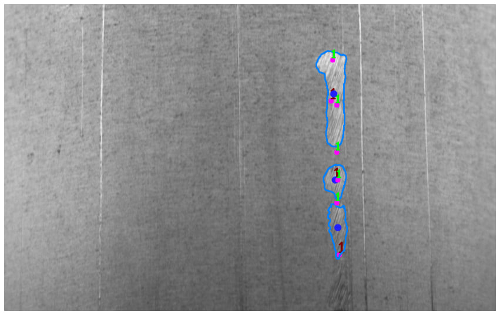

# Обнаружение деффектов труб (Atomic hack 2023)

Проект содержит скрипты для обучения / инференса моделей для хакатона.
Цель данного исследования заключалась в разработке модели для автоматического обнаружения дефектов на поверхности трубы. Были предоставили только абстрактные точки дефектов, на основе которых использовалась модель SAM для определения областей дефектов на изображениях. 
<p>
    
</p>

#### Files:
 - create_sam_dataset.ipynb - скрипт преобразования исходного датасета в сегментационные маски  
 - split_data.ipynb - скрипт для разбиения данных на train / test  
 - prepare_yolov8_mark_from_raw_points_and_tensorrt_export.ipynb - скрипт подготовки данных для обучения yolov8, а так же импорта ее в tensorrt  
 - multipoint_default_yolo_predict.ipynb - скрипт инференса базовой модели yolov8  
 - multipoint_default_yolo_sam_predict.ipynb - скрипт инференса модели yolov8 + sam + postprocessing  
 - calc_metrics.ipynb - скрипт для рассчёта метрики  


### Download model
Download default yolov8 model from [Google Drive](https://drive.google.com/file/d/1iDLvSRojz5H-0oHW58LAIA3D4A8CD53V/view?usp=sharing) and put into project folder.  
Download tensorrt yolov8 model from [Google Drive](https://drive.google.com/file/d/1hrNv5YIXuR5A7p4D5NF_SQo02T4l6uP_/view?usp=sharing) and put into project folder.  


### Download SAM and install SAM model
```bash
pip install git+https://github.com/facebookresearch/segment-anything.git
wget -O ./sam_vit_h_4b8939.pth  https://dl.fbaipublicfiles.com/segment_anything/sam_vit_h_4b8939.pth
```

### Getting Started
```bash
git clone https://github.com/TheDenk/atomic-hack-2023
cd atomic-hack-2023

pip -r install requirements.txt
```

## Демонстрационное Flask приложение для детектирования дефектов на трубе
Файлы приложения находятся в папке web-ap

#### Cтавим requirements  
```bash
pip install -r requirements.txt
```

#### Пример запуска  
```bash
python app.py
```

#### Docker
Build 
```bash
docker build --tag flask-tube . 
```

Run  
```bash
docker run -p PORT:5000 --name flask-tube -t flask-tube:latest  
```
## Обнаружение дефектов на поверхности трубы c помощью сегментационной модели

### Обучение модели:
- Применена архитектура U-Net для обучения модели.
- Использовались различные бэкбоны: ResNet, EfficientNet.
- Экспериментировали с комбинациями функций потерь, такими как Dice Loss и Cross-Entropy Loss.

## Результаты
После проведения экспериментов с разными моделями и функциями потерь была выбрана модель U-Net с бэкбоном EfficientNet, как показавшая наилучшие результаты:
- **Модель:** U-Net с бэкбоном EfficientNet
- **Метрика:** Intersection over Union (IoU) составила 0.47.


## Autors
- <a href="https://github.com/thedenk">Karachev Denis</a>
- <a href="https://github.com/lolpa1n">Smolin Ilya</a>
- <a href="https://github.com/Gabijke">Isakov Maksim</a>
- <a href="https://github.com/licksylick">Lyskov Roman</a>
- <a href="https://github.com/ArtyomKondakov">Kondakov Artyom</a>